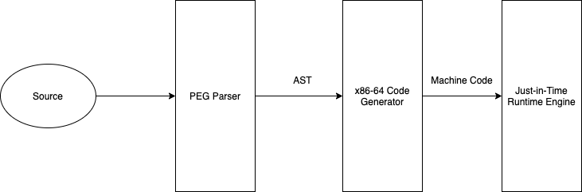
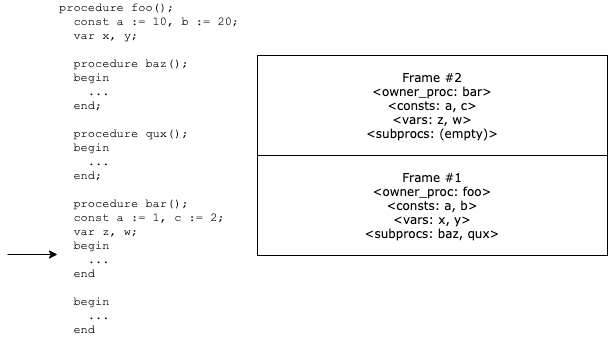
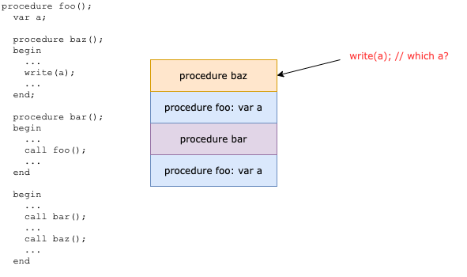

# 设计任务

## 题目

一个 Pascal 语言子集 (PL/0) 编译器的设计与实现

## PL/0 语言的 BNF 描述

```js
<prog> → program <id>; <block>
<block> → [<condecl>][<vardecl>][<proc>]<body>
<condecl> → const <const>{,<const>};
<const> → <id>:=<integer>
<vardecl> → var <id>{,<id>};
<proc> → procedure <id>（[<id>{,<id>}]）;<block>{;<proc>}
<body> → begin <statement>{;<statement>} end
<statement> → <id> := <exp>               
    | if <lexp> then <statement>[else <statement>]
    | while <lexp> do <statement>
    | call <id>（[<exp>{,<exp>}]）
    | <body>
    | read (<id>{，<id>})
    | write (<exp>{,<exp>})
<lexp> → <exp> <lop> <exp>|odd <exp>
<exp> → [+|-]<term>{<aop><term>}
<term> → <factor>{<mop><factor>}
<factor>→<id>|<integer>|(<exp>)
<lop> → =|<>|<|<=|>|>=
<aop> → +|-
<mop> → *|/
<id> → l{l|d}   （注: l表示字母）
<integer> → d{d}

注释: 
<prog>: 程序;
<block>: 块、程序体;
<condecl>: 常量声明;
<const>: 常量;
<vardecl>: 变量声明;
<proc>: 分程序;
<body>: 复合语句;
<statement>: 语句;
<exp>: 表达式;
<lexp>: 条件;
<term>: 项;
<factor>: 因子;
<aop>: 加法运算符;
<mop>: 乘法运算符;
<lop>: 关系运算符.
```

# 系统设计

## 整体设计思想

整体系统架构如下图所示：



编译前端采用解析表达式文法 (Parsing Expression Grammer, PEG) 文法 [1] 统一描述词法和语法，并自动生成语法分析器，实现源程序到抽象语法树 (AST) 的转换。前端生成的 AST 交由后端代码生成器进行语义分析，生成 x86-64 机器码后，由即时编译引擎 (JIT Runtime) 加载执行。

本系统采用 Rust 语言 [2] 实现。Rust 速度惊人且内存利用率极高。由于没有运行时和垃圾回收，它能够胜任对性能要求特别高的服务，可以在嵌入式设备上运行，还能轻松和其他语言集成; Rust 丰富的类型系统和所有权模型保证了内存安全和线程安全，让开发者在编译期就能够消除各种各样的错误; Rust 拥有出色的文档、友好的编译器和清晰的错误提示信息，还集成了一流的工具——包管理器和构建工具，智能自动补全和类型检查的多编辑器支持，以及自动代码格式化等等。

## 编译前端设计

解析表达式文法，简称 PEG（Parsing Expression Grammar），是一种分析型形式文法。PEG 在 2004 年由 Bryan Ford 推出，它与 20 世纪 70 年代初引入的自顶向下的语法分析语言家族密切相关。

在语法上，PEG 很接近上下文无关文法（CFG），但是它们采用了不同的解释。例如 PEG 中的选择操作符总是会选中第一个匹配项，而在 CFG 中则是不明确的。这更接近于字符串识别在实际中的应用，例如使用递归下降解析器的情况。另外不像 CFG，PEG 不能有二义性：在解析一个字符串的时候，只能有单一确定的语法分析树。这个特性使得 PEG 更适合计算机语言的解析。

形式上，一个解析表达式文法由以下部分组成：

- 一个有限的非终结符的集合 N
- 一个有限的终结符的集合 Σ，和 N 没有交集
- 一个有限的解析规则的集合 P
- 一个被称作开始表达式的解析表达式 e(S)

P 中的每一个解析规则以 A ← e 的形式出现，这里 A 是一个非终结符，e 是一个解析表达式。解析表达式是类似正则表达式的层次表达式：

1. 原子解析表达式由以下组成:
   - 任何的终结符，
   - 任何的非终结符，
   - 空字符串 ε.
2. 给定已经存在的解析表达式 e, e1 和 e2, 一个新的解析表达式可以通过以下操作构成:
   - 序列: e1 e2
   - 有序选择: e1 / e2
   - 零个或更多: e*
   - 一个或更多: e+
   - 可选: e?
   - 肯定断言: &e
   - 否定断言: !e

本课程设计采用 Rust 语言的 `peg` 库 [3] 实现 PEG 文法语法分析器的自动构造。`peg` 库具有以下特性：

- 解析 `&str`, `&[u8]`, `&[T]` 或自定义类型的输入
- 自定义解析错误报告
- 规则可接受参数，形成规则模版
- 对前缀/中缀/后缀表达式的优先级爬升
- 良好的调试支持

`peg::parser!{}` 宏对其内部 `grammar NAME() for INPUT_TYPE { ... }` 形式的语法规则集定义进行解析，用以匹配语言的各组件。

规则定义形式为 `rule NAME(PARAMETERS) -> RETURN_TYPE = PEG_EXPR`. `=` 符号后的规则体是一个 PEG 表达式，定义了匹配输入产生输出的方式。

PEG 表达式在输入的特定位置求值。当表达式匹配时，输入位置向前移动，且表达式可以返回一个可选的值。

`peg::parser!{}` 宏展开到一个包含诸类型表达式解析器的 Rust 模块。语法分析通过调用起始表达式的解析器进行，调用返回一个 `Result<T, ParseError>` 类型的结果。

本课程设计的前端 PEG 文法定义如下：

```rust
peg::parser! {
    pub grammar parser() for str {
        rule integer() -> Integer = n:$(['0'..='9']+) { Integer(n.into()) }
        rule id() -> Identifier = x:$((['a'..='z'] / ['A'..='Z']) (['a'..='z'] / ['A'..='Z'] / ['0'..='9'])*) { Identifier(x.into()) }
        rule mop() -> Mop = "*" { Mop::Mul } / "/" { Mop::Div }
        rule aop() -> Aop = "+" { Aop::Add } / "-" { Aop::Sub }
        rule lop() -> Lop = "=" { Lop::Eq } / "<>" { Lop::Ne } / "<=" { Lop::Le } / "<" { Lop::Lt } / ">=" { Lop::Ge } / ">" { Lop::Gt }
        rule factor_v() -> FactorV = x:id() { FactorV::Id(x) } / x:integer() { FactorV::Integer(x) } / "(" _ e:expr() _ ")" { FactorV::Expr(Box::new(e)) }
        rule factor() -> Factor = v:factor_v() { Factor { v } }
        rule expr() -> Expr =
            "+" _ i:expr_inner() { Expr { neg: false, left_term: i.0, right_term: i.1 } } /
            "-" _ i:expr_inner() { Expr { neg: true, left_term: i.0, right_term: i.1 } } /
            i:expr_inner() { Expr { neg: false, left_term: i.0, right_term: i.1 } }
        rule expr_inner() -> (Term, Option<(Aop, Term)>) =
            l_term:term() _ op:aop() _ r_term:term() { (l_term, Some((op, r_term))) } /
            l_term:term() { (l_term, None) }
        rule term() -> Term =
            left_factor:factor() _ op:mop() _ right_factor:factor() { Term { left_factor, right_factor: Some((op, right_factor)) } } /
            left_factor:factor() { Term { left_factor, right_factor: None } }
        rule l_expr() -> LExpr =
            "odd" _ e:expr() { LExpr { v: LExprV::Odd(e) } } /
            l:expr() _ op:lop() _ r:expr() { LExpr { v: LExprV::Lop(l, op, r) } }
        rule stmt_v() -> StmtV =
            l:id() _ ":=" _ r:expr() { StmtV::Assign(l, r) } /
            "if" _ cond:l_expr() _ "then" _ l:stmt() _ "else" _ r:stmt() { StmtV::If(cond, Box::new(l), Some(Box::new(r))) } /
            "if" _ cond:l_expr() _ "then" _ l:stmt() { StmtV::If(cond, Box::new(l), None) } /
            "while" _ cond:l_expr() _ "do" _ l:stmt() { StmtV::While(cond, Box::new(l)) } /
            "call" _ t:id() _ "(" _ e:(_ x:expr() _ {x}) ** "," _ ")" { StmtV::Call(t, e) } /
            "read" _ "(" _ i:(_ x:id() _ {x}) ** "," _ ")" { StmtV::Read(i) } /
            "write" _ "(" _ e:(_ x:expr() _ {x}) ** "," _ ")" { StmtV::Write(e) } /
            b:body() { StmtV::Body(b) }
        rule stmt() -> Stmt = v:stmt_v() { Stmt { v } }
        rule body() -> Body = "begin" _ stmts:(_ x:stmt() _ {x}) ** ";" _ "end" { Body { stmts } }
        rule procedure() -> Proc =
            "procedure" _ name:id() _ "(" _ args:(_ x:id() _ {x}) ** "," _ ")" _ ";" _ b:block() { Proc { name, args, block: b} }
        rule block() -> Block =
            c:condecls()? _ v:vardecls()? _ p:((_ p:procedure() _ {p}) ** ";")? _ b:body() {
                Block {
                    condecls: c.unwrap_or(vec![]),
                    vardecls: v.unwrap_or(vec![]),
                    procs: p.unwrap_or(vec![]),
                    body: b,
                }
            }
        rule condecls() -> Vec<(Identifier, Integer)> = "const" _ e:(_ i:id() _ ":=" _ v:integer() _ { (i, v) }) ** "," _ ";" { e }
        rule vardecls() -> Vec<Identifier> = "var" _ i:(_ i:id() _ {i}) ** "," _ ";" { i }
        pub rule program() -> Program = "program" _ name:id() _ ";" _ block:block() { Program { name, block } }
        rule _() =  quiet!{[' ' | '\t' | '\n' | '\r']*}
    }
}
```

对 PL/0 源程序进行语法分析时，调用 `program` 规则即可。

## 语义分析与代码生成

### 架构

本课程设计直接将 PL/0 生成的 AST 编译为 x86-64 机器码。x86-64 机器码的汇编采用 Rust 语言的 `dynasm` 库 [4] 实现。

翻译状态定义如下：

```rust
pub struct TranslationState {
    frames: Vec<Frame>,
    a: Assembler,
    next_proc_id: u32,
    entry: AssemblyOffset,

    read_ext: DynamicLabel,
    write_ext: DynamicLabel,
}
```

其中，`frames` 字段为 PL/0 过程嵌套栈的当前状态。其 `Frame` 类型定义如下：

```rust
pub struct Frame {
    owner_proc: Identifier,
    owner_proc_id: u32,
    head: DynamicLabel,
    subprocs: Vec<Frame>,
    num_args: usize,
    vars: BTreeSet<Identifier>,
    consts: BTreeMap<Identifier, Integer>,
    raw_locations: BTreeMap<Identifier, i32>,
}
```

代码生成器在输入程序上对每个过程递归执行语义分析与代码生成，产生目标代码。

### 代码生成

对于每个程序，首先定义输入输出的尾调用跳板 (trampoline) 代码段：

```rust
let read_ext = a.new_dynamic_label();
let write_ext = a.new_dynamic_label();

dynasm!(a
    ; =>read_ext
    ; mov rax, QWORD (crate::runtime::do_read as i64)
    ; jmp rax // tail call
    ; =>write_ext
    ; mov rax, QWORD (crate::runtime::do_write as i64)
    ; jmp rax // tail call
);
```

然后从主程序开始，逐子过程递归生成代码。

函数入口处，首先初始化栈帧，分配局部变量存储空间，并复制参数到当前栈帧中：

```rust
// Allocate slots
dynasm!(self.a
    ; =>head
    ; push rbp
    ; lea rbp, [rsp + 16 + (p.args.len() * 8) as i32]
    ; sub rsp, (p.num_slots() * 8) as i32

    // (function_id, prev_frame)
    ; mov QWORD [rsp + 0], proc_id as i32
    ; mov [rsp + 8], rbp

    // Move rbp to start of arguments
    ; sub rbp, (p.args.len() * 8) as i32
);

// Copy arguments
for i in 0..p.args.len() {
    dynasm!(self.a
        ; mov rax, [rbp + (i as i32) * 8]
        ; mov [rsp + 16 + (i as i32) * 8], rax
    );
}

// Reset rbp to start of storage area
dynasm!(self.a
    ; mov rbp, rsp
);
```

然后调用 `generate_body` 函数生成函数体。`generate_body` 对于块中的每条语句逐一调用 `generate_stmt` 生成代码。

当过程调用 (`call` 语句）发生时，代码生成器对参数逐一求值推到机器栈上，查询符号表得到调用目标地址，生成 x86-64 `call` 指令调用目标函数，调用返回后清理参数占用的机器栈空间。

```rust
StmtV::Call(ref target, ref args) => {
    for arg in args.iter().rev() {
        self.generate_expr(arg)?;
        dynasm!(self.a ; push rax);
    }
    let target = self.lookup_call_target(target, args.len())?;
    dynasm!(self.a ; call =>target);
    dynasm!(self.a ; add rsp, (args.len() * 8) as i32);
}
```

当系统 I/O（`read` / `write` 语句）发生时，首先根据 System V 调用约定 [5] 对机器栈指针进行 16 字节对齐处理，然后调用跳板 `read_ext` 或 `write_ext`，经由尾调用进入运行环境。由于此时没有使用任何调用方保存寄存器 (caller-saved registers) ，无需保存/恢复寄存器。

```rust
StmtV::Read(ref l) => {
    dynasm!(self.a ; and rsp, -16); // System V stack alignment
    for id in l {
        dynasm!(self.a ; call =>self.read_ext);
        self.write_var(id)?;
    }
    dynasm!(self.a ; mov rsp, rbp);
}
StmtV::Write(ref l) => {
    dynasm!(self.a ; and rsp, -16); // System V stack alignment
    for e in l {
        self.generate_expr(e)?;
        dynasm!(self.a ; mov rdi, rax ; call =>self.write_ext);
    }
    dynasm!(self.a ; mov rsp, rbp);
}
```

过程中的所有语句执行完毕后，清理自身栈帧，并执行 x86-64 `ret` 指令返回：

```rust
dynasm!(self.a
    ; add rsp, (p.num_slots() * 8) as i32
    ; pop rbp
    ; ret
);
```

### 符号表

本设计采用栈式结构维护符号表：



PL/0 语言要求支持嵌套的符号查找。对常量与过程可以静态查找，只需遍历嵌套栈即可：

常量查找：

```rust
fn read_value(&mut self, t: &Identifier) -> Result<()> {
    for frame in self.frames.iter().rev() {
        // ...
        if let Some(value) = frame.consts.get(t) {
            let x: u64 = value.0.parse().map_err(|e| CodegenError::BadInteger)?;
            dynasm!(self.a ; mov rax, QWORD x as i64);
            return Ok(());
        }
    }
    return Err(CodegenError::ValueNotFound.into());
}
```

调用目标过程查找：

```rust
fn lookup_call_target(&mut self, t: &Identifier, num_args: usize) -> Result<DynamicLabel> {
    for frame in self.frames.iter().rev() {
        if let Some(target) = frame.subprocs.iter().find(|x| &x.owner_proc == t) {
            if target.num_args != num_args {
                return Err(CodegenError::ArgumentCountMismatch.into());
            }
            return Ok(target.head.clone());
        }
        if &frame.owner_proc == t {
            if frame.num_args != num_args {
                return Err(CodegenError::ArgumentCountMismatch.into());
            }
            return Ok(frame.head.clone());
        }
    }

    Err(CodegenError::ProcNotFound.into())
}
```

但是对变量则须动态查找。由于双向递归的存在，运行栈上可能存在同一过程不连续的多个活动记录:



因此我们无法静态确定所有对非局部变量的引用。这要求我们实现对运行栈的动态展开 (unwinding) 。

本设计通过遍历 x86-64 栈帧实现变量查找：

```rust
fn lookup_var_indirect(&mut self, t: &Identifier) -> Result<i32> {
    for frame in self.frames.iter().rev() {
        if let Some(&offset) = frame.raw_locations.get(t) {
            // unwind
            dynasm!(self.a
                ; mov rcx, rbp
                ; mov rdx, frame.owner_proc_id as i32
                ; head:
                ; mov rcx, [rcx + 8]
                ; mov r8, [rcx]
                ; cmp r8, 0
                ; je >fail
                ; cmp r8, rdx
                ; je >ok
                ; jmp <head
                ; fail:
                ; ud2
                ; ok:
            );
            return Ok(offset);
        }
    }
    return Err(CodegenError::VariableNotFound.into());
}
```

## 即时代码加载与执行

代码生成结束后，本设计通过即时 (Just-in-Time, JIT) 执行机制将生成的机器码加载进内存，动态链接，并调用入口点。此部分主要使用 `dynasm` 库实现，具体步骤如下：

1. 调用 `mmap` 分配 `rw-` 内存空间
2. 复制链接前的机器码到目标内存空间
3. 在目标内存空间中重定位机器码，完成动态链接
4. 调用 `mprotect` 将目标内存空间权限更改为 `r-x`
5. 计算程序入口点并调用

# 总结

本设计实现了 PL/0 的完整语法和语义和从源程序到 x86-64 机器码的完整编译流程。

# 参考资料

1. Parsing Expression Grammar - Wikipedia: [https://en.wikipedia.org/wiki/Parsing_expression_grammar](https://en.wikipedia.org/wiki/Parsing_expression_grammar)
2. Rust Programming Language: [https://www.rust-lang.org/](https://www.rust-lang.org/)
3. `rust-peg`: [https://github.com/kevinmehall/rust-peg](https://github.com/kevinmehall/rust-peg)
4. `dynasm-rs`: [https://github.com/CensoredUsername/dynasm-rs](https://github.com/CensoredUsername/dynasm-rs)
5. System V Application Binary Interface: [https://uclibc.org/docs/psABI-x86_64.pdf](https://uclibc.org/docs/psABI-x86_64.pdf)
